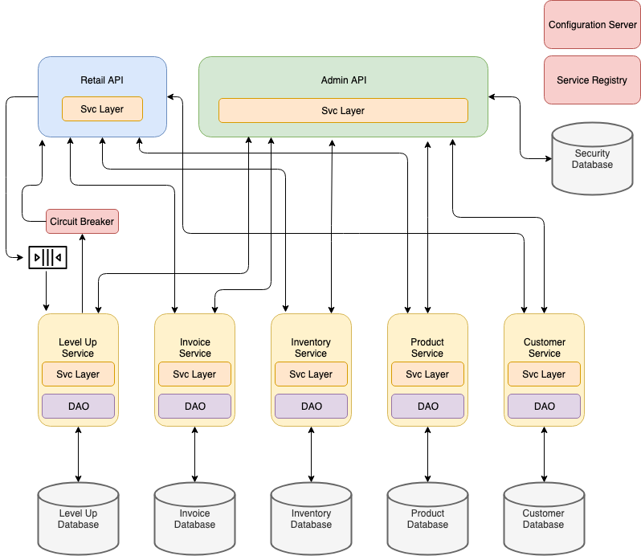

# Cloud Native Game Store Project

## Project Scenario
Your company has decided to move forward with a Game Store API project. This set of REST APIs will support both web and mobile clients for customers. The original project was designed and implementation was started before the company began moving toward a cloud-native architecture. The original design is a traditional monolithic application with a single database. You have been asked to move the current design and partial implementation to a design that follows the company's new cloud-native architectural standards.

---

## Structure

* This project is built using Spring Boot and Spring MVC.

---

### Cloud-Native Design

The design incorporates many elements of a modern cloud-native architecture including:

* Configuration Server
* Service Registry
* Queues
* Circuit Breaker
* Caching
* Micoservices
* Backend for Frontend (BFF) edge services



Facets of the application:

* Retail API
* Level Up Service
* Invoice Service
* Inventory Service
* Admin API
* Security
* Product Service
* Customer Service
* Config Server
* Eureka Server

#### Database Scripts

These are the SQL creation scripts that are used to create the databases behind each of the microservices:

##### Level Up

```sql
create schema if not exists level_up;
use level_up;

create table if not exists level_up (
	level_up_id int(11) not null auto_increment primary key,
    customer_id int(11) not null,
    points int(11) not null,
    member_date date not null
);
```

##### Invoice

```sql
create schema if not exists invoice;
use invoice;

create table if not exists invoice (
	invoice_id int(11) not null auto_increment primary key,
    customer_id int(11) not null,
    purchase_date date not null
);

create table if not exists invoice_item (
	invoice_item_id int(11) not null auto_increment primary key,
    invoice_id int(11) not null,
    inventory_id int(11) not null,
    quantity int(11) not null,
    unit_price decimal(7,2) not null    
);

alter table invoice_item add constraint fk_invoice_item_invoice foreign key (invoice_id) references invoice(invoice_id);
```

##### Inventory

```sql
create schema if not exists inventory;
use inventory;

create table if not exists inventory (
	inventory_id int(11) not null auto_increment primary key,
    product_id int(11) not null,
    quantity int(11) not null
);
```

##### Product

```sql
create schema if not exists product;
use product;

create table if not exists product (
	product_id int(11) not null auto_increment primary key,
    product_name varchar(50) not null,
    product_description varchar(255) not null,
    list_price decimal(7,2) not null,
    unit_cost decimal(7,2) not null
);
```

##### Customer

```sql
create schema if not exists customer;
use customer;

create table if not exists customer (
	customer_id int(11) not null auto_increment primary key,
    first_name varchar(50) not null,
    last_name varchar(50) not null,
    street varchar(50) not null,
    city varchar(50) not null,
    zip varchar(10) not null,
    email varchar(75) not null,
    phone varchar(20) not null
);
```

##### Security

```sql
create schema if not exists spring_security;
use spring_security;

create table if not exists users(
	username varchar(50) not null primary key,
	password varchar(100) not null,
	enabled boolean not null
);

create table if not exists authorities (
	username varchar(50) not null,
	authority varchar(50) not null,
	constraint fk_authorities_users foreign key(username) references users(username));
	create unique index ix_auth_username on authorities (username,authority
);

```

---

## Features and Functional Requirements

All of the functional requirements of the system are listed in this section.

### Configuration Server

##### Port

This service runs on port 9999.

### Service Registry

##### Port

This service runs on port 8761.

---

## Architectural Requirements

This section contains all of the architectural requirements of the system.

### Configuration Server

All services in the system use the Configuration Server for all of their configuration files.

### Service Registry

All backing services register with the Service Registry. The Retail API and Admin API web services use the Service Registry to locate the backing services that they use.

### Spring Security
The Admin API is protected by Spring Security

* Uses the default Spring Security schema.
* All passwords hashed with BCrypt.

### Interaction with Backing Services

Communication to backing services from the Retail API and Admin API web services is done using Feign clients in a Service Layer component.

### Database Interaction

All DAOs use JdbcTemplates and Prepared Statements.

### Caching

Caching is incorporated as appropriate in this application. 

### Error Handling

* ControllerAdvice implemented to handle exceptions and return appropriate HTTP status codes and data when exceptions occur.

### Documentation

REST APIs are documented with Swagger.

---
